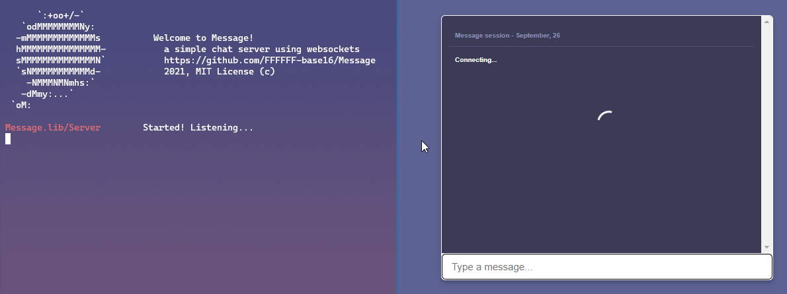

# Message

A chat room project meant to explore the capabilities of web sockets using Python as a backend server, as well as practice basic database structure, password hashing, networking, and server management. The entire Python server is asynchronous, using libraries such as <b>asyncio</b>, <b>aiosqlite</b>, and <b>websockets</b>. Console output requires the <b>colorama</b> library. 

---

## Demo


Above shows a *side-by-side* demo of the Python server *(left)* and the HTML/JavaScript client *(right)*.

The `/identify <username>` command can be typed in chat to login to a registered account. This will display a checkmark beside the client's name.

---

## Run from command line

From the <b>/server</b> directory, launch the following command:
```
$ python3 boot.py
```
*\*Required libraries:* **asyncio, aiosqlite, websockets, colorama**

*\*Requires Python version 3.6+*

**Note:** This chat system is not intended for production use. It was simply a testing ground for learning Python/JS networking. Essential security measures not implemented in this program. 

---

## Database

The database consists of three colums: 

ID (Primary Key, Integer, Autoincrement), Username (Text), Password (Text: sha256-hashed)

Sqlite is used for the database, and therefore a database is stored locally in the /server folder (where execution is done). A sample *Message.db* is provided in the repository.

---

## References
- https://websockets.readthedocs.io/en/9.0.1/intro.html
- https://docs.python.org/3/library/asyncio.html
- https://github.com/omnilib/aiosqlite